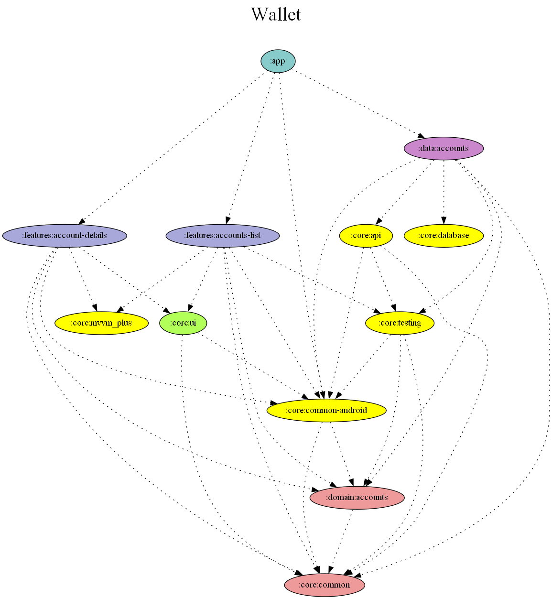

# Wallet App

**This app gives the user the capability to take a quick look on his wallet accounts. User is also able to view the further details of his accounts as well as the past transactions. Moreover, it is possible to mark an account as favorite and view partial details of it even when offline**

| Accounts                                                                                         | Details                                                                                           |
|--------------------------------------------------------------------------------------------------|---------------------------------------------------------------------------------------------------|
| 
 
 | 
  
 |

## Technologies
- Multiple modules
- Clean Architecture
- MVVM+ (mix of MVVM with MVI)
- Single Activity
- Navigation Component
- Material UI
- Kotlin 
  - Coroutines
  - Flows
- Dependency Injection **(Dagger Hilt)**
- Networking **(Retrofit)** 
- Database **(Room)**
- Unit Testing & UI Testing
  - JUnit4
  - Truth
  - Turbine
  - **MockK**/Mockito
  - Espresso
- Gradle
  - using Kotlin (.kts) instead of Groovy (autocompletion)
  - Version Catalog (single source of truth for dependencies and plugins versions)
    - with a drawaback (unfortunately), cannot use precompiled script plugins for the several modules.
    - The solution is the **Convention Plugins**

  
**This app has been designed, built and implemented having in the multi-module (by layer and feature) and clean approach in mind**

## Dependency Graph

### Modules

**App Module**
> App module is the start point of this project, it is aware of the other features modules provided. It contains the one Activity used in this app and it contains the navigation graph, which is needed to navigate through the features screens of this app. It also depends on the **:data** modules as well as other modules.

**Features Modules**
> These modules are essentially representing the User Interface of this app. They are indendent of each other and they are not aware of the :app module. 
> Specifically, they are aware of ther own navigation graph if exists, of the corresponding :domain module plus other, such as :data module.
> > **Portfolio** :
> > Display user's accounts found in his wallet.
> 
> > **Account Details** :
> > Displays extra details for the selected account

**Domain Module**
> Contains the **UseCases** needed by the feature modules to execute certain actions. Apart from that, provide the models which they are provided to the UI as part of the UseCase's response. Finally, the contract (eg AccountRepository) is being defined here (dependency inversion principle).

**Data Module**
> This module is responsible to fetch and return us, the data received/fetched/stored for the user. It knows what are the data sources that can be used to achieve that.

**Core Module**
> Contains code and implementations that they are used throughout the app
> > **Common** Common classes and utilities used throughout out the app. -- **Java/Kotlin library**
> 
> > **Common-Android** Same as above, however this module is dependent to Android, since it provides methods on top of that. -- **Android Library**
> 
> > **Testing** Utilities and classes needed for testing -- **Android Library**
> 
> > **Api** Defines the contract that gives us the capability to fetch from the remote service. -- **Android Library/Retrofit**
> 
> > **Database** Contains the implementation for manipulating data saved locally. -- **Android Library/Room**
> 
> > **Mvvm_plus** Defines an implementation of MVVM with MVI architecture approaches.
> > Using UiState to wrap data that they will be shown in the screens
> > Using Intents **(not Android Intents)** to define the actions that can take place by the user.
> > Using Events to show a dialog/toast/snackbar as a result of an action triggered by the user and it does not affect the data displayed.
> 
> **UI** Defines custom views, extensions functions and other common method/functions/utilities that can used in a particular feature module of this app

**What else?**

* the cleaner (code), the better -- at least as much as i could thought of this during development
* Clean architecture approach
* Dependency Inversion principle
* Separation of concerns
* Single Source of true (both on data repository -> viewmodel etc. and in modules dependencies, ui extensions can be found only in one module or the skeleton of the view architecture)
* **not**(Interface Segregation), out of the scope of this app
* Structured concurrency (coroutines)
* Streams (Kotlin Flows)
* Mixing coroutines & flows with Android Libraries. For instance, a query from Room DAO returns Flows, thus it emits a new stream each time a change happens.
* Using custom type to wrap the response from the Retrofit requests, see **[ApiResponse]** -- I did not have time to write a custom adapter and integrate this type directly as a response of a request. Anyway, you can always take a closer look and see the implementation and the tests written for this.
* Another custom type exists for wrapping the result of an action -- (Sure it can be used instead of the above custom type, but I don't prefer it) 
* Functional Use cases by taking advantage of Kotlin's function API (instead of having boilerplate everywhere by defining class types, why not using Functional (SAM) Interfaces?)
* Kotlin Api (inline, crossinline, lambdas, sam interfaces, extensions)
* Combining MVVM with MVI, call it MVVM_plus or MVVMi, **suggest me a name please**
* Tests
  * Unit tests using Mocks or Fakes (tests run on isolation, that means we use mocks or fake implementations for the dependencies of certain class/method being under test)
  * Integration tests, meaning that we test two or more components together and not in isolation of each other
  * Instrumentation Tests
    * Room Database/DAO for instance
    * UI Tests using Hilt and Espresso
  * **Replicating the behavior of a flow using fake impls and MutableSharedFlow)

### References
- Gradle
  - https://proandroiddev.com/using-version-catalog-on-android-projects-82d88d2f79e5
  - https://proandroiddev.com/single-source-of-truth-for-your-build-scripts-72d584534949
  - https://stackoverflow.com/questions/70550883/warning-the-following-options-were-not-recognized-by-any-processor-dagger-f
  - https://github.com/JakeWharton/SdkSearch/blob/master/gradle/projectDependencyGraph.gradle (needs GraphViz program to be installed in order to run successfully)
  - more TBA