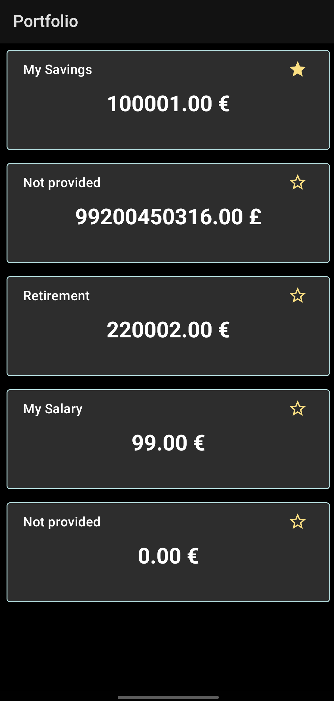
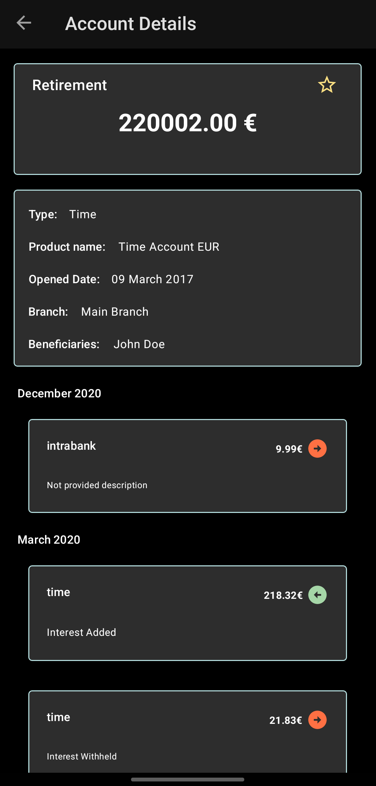

# assignment Wallet

| Accounts                                    | Details                                   |
|---------------------------------------------|-------------------------------------------|
|  |  |

## Technologies
- Multiple modules
- Clean Architecture
- MVVM+ (mix of MVVM with MVI)
- Single Activity
- Navigation Component
- Material UI
- Kotlin 
  - Coroutines
  - Flows
- Dependency Injection **(Dagger Hilt)**
- Networking **(Retrofit)** 
- Database **(Room)**
- Unit Testing & UI Testing
  - JUnit4
  - Truth
  - Turbine
  - Mockito/MockK
  - Espresso
- Gradle
  - using Kotlin (.kts) instead of Groovy (autocompletion)
  - Version Catalog (single source of truth for dependencies and plugins versions)
    - with a drawaback (unfortunately), cannot use precompiled script plugins for the several modules.
    - The solution is the **Convention Plugins**

### References
- Gradle
  - https://proandroiddev.com/using-version-catalog-on-android-projects-82d88d2f79e5
  - https://proandroiddev.com/single-source-of-truth-for-your-build-scripts-72d584534949
  - https://stackoverflow.com/questions/70550883/warning-the-following-options-were-not-recognized-by-any-processor-dagger-f
  - https://github.com/JakeWharton/SdkSearch/blob/master/gradle/projectDependencyGraph.gradle (needs GraphViz program to be installed in order to run successfully)

more TBA